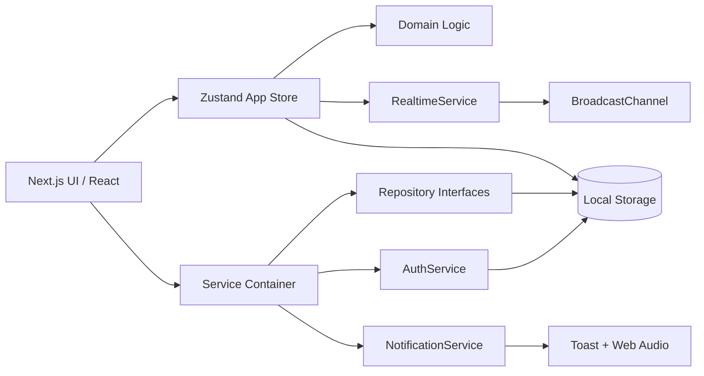

# Demo System Architecture

## 1. Requirements summary

Flukex POS เป็นเดโม SaaS ร้านอาหารแบบ multi-tenant ที่มี public SEO website และ product demo ครบตั้งแต่ Admin → POS/QR → Kitchen/Bar → Reports โดยภาษาไทยเป็นหลัก และเตรียม locale `th/en` ไว้แล้ว เดโมต้องไม่เชื่อมบริการจริงทุกชนิดและเก็บข้อมูลเฉพาะในเบราว์เซอร์

หลักการวิศวกรรม:

- TypeScript strict; UI ไม่อ่าน Local Storage โดยตรง
- Domain calculation และ entitlement เป็น source of truth กลาง
- Services/repositories เป็น port สำหรับเปลี่ยน mock adapter เป็น Supabase
- Zustand เป็น client state orchestration; persist adapter อยู่ชั้น store/infrastructure
- Zod ตรวจ input ที่ boundary
- Server Components เป็นค่าเริ่มต้น; Client Components อยู่เฉพาะ interaction

## 2. Architecture



Production migration เปลี่ยน adapters ด้านขวาเป็น Supabase โดยไม่แก้ component contracts

## 3. Sitemap and application routes

### Public / SEO

| Route | จุดประสงค์ |
|---|---|
| `/` | Homepage |
| `/features` | ภาพรวมฟีเจอร์ |
| `/pricing` | ราคา 3 แผน |
| `/plan-comparison` | ตารางเปรียบเทียบ |
| `/restaurant-pos` | POS landing |
| `/qr-ordering` | QR landing |
| `/kitchen-display` | KDS landing |
| `/faq`, `/contact` | Support / conversion |
| `/register`, `/login` | Demo auth |
| `/privacy`, `/terms` | Legal |
| `/sitemap.xml`, `/robots.txt` | SEO infrastructure |

### Product demo (noindex)

| Route | จุดประสงค์ |
|---|---|
| `/dashboard` | KPI, chart, orders, usage |
| `/dashboard/restaurant` | Restaurant details |
| `/dashboard/branches` | Branches |
| `/dashboard/employees` | Users and roles |
| `/dashboard/categories` | Categories |
| `/dashboard/products` | Product CRUD |
| `/dashboard/tables` | Tables, status, QR |
| `/dashboard/orders` | Orders and status |
| `/dashboard/reports` | Reports and exports |
| `/dashboard/subscription` | Plan and entitlement |
| `/dashboard/settings` | VAT, service charge, receipt |
| `/dashboard/integrations` | Simulated connectors and notification log |
| `/pos` | Touch POS |
| `/order/[restaurantSlug]/table/[tableToken]` | Mobile QR Ordering |
| `/kitchen`, `/bar` | Station displays |

## 4. User flows

### Owner onboarding

1. Marketing CTA → Register
2. Create user + restaurant simulation
3. Select plan → centralized entitlement state
4. Enter Dashboard → edit products/tables/settings

### POS order

1. Cashier selects table and products
2. Add modifier, quantity, note
3. `calculateOrderTotals` calculates discount/service/VAT/grand total
4. Select simulated payment
5. `addOrder` persists and emits `ORDER_CREATED`
6. Kitchen/Bar filter items by station

### QR order

1. Customer scans token URL
2. Browse/search/filter → cart → submit
3. Order persists; table becomes `OCCUPIED`
4. Browser toast + audio; KDS highlights new order
5. Customer views status, calls staff or requests bill

### Kitchen / Bar

1. Subscribe through `RealtimeService`
2. Filter station items
3. Advance `WAITING → PREPARING → READY → SERVED`
4. State persists and other tabs rehydrate

## 5. Folder structure

```text
src/
  app/                 App Router pages, metadata, sitemap, robots
  components/
    auth/              Login/register/onboarding
    dashboard/         Admin modules
    kds/               Kitchen and Bar
    marketing/         SEO website
    order/             QR Ordering
    pos/               Touch POS
    ui/                shadcn-style primitives
  config/              Central entitlements
  data/                Default mock tenant data
  domain/              Types, Zod schemas, financial calculations
  i18n/                Typed Thai/English dictionary boundary
  services/            Contracts + mock adapters + service container
  store/               Zustand orchestration and persistence
```

## 6. Data models and interfaces

Core types live in `src/domain/types.ts`: `Restaurant`, `Branch`, `DemoUser`, `Category`, `Product`, `RestaurantTable`, `Order`, `OrderItem`, `NotificationLog`, `DemoSession`.

ทุก aggregate มี `tenantId` และ timestamp. Station, status, role, plan และ payment ใช้ string unions เพื่อให้ Supabase enum mapping ตรงไปตรงมา

Service contracts in `src/services/contracts.ts`:

- `AuthService`
- `Repository<T>` and product/order/restaurant variants
- `SubscriptionRepository`
- `RealtimeService`
- `NotificationService`
- `ServiceContainer`

## 7. Entitlement configuration

`src/config/plans.ts` เป็น source of truth เดียวของ:

- `maxBranches`, `maxUsers`, `maxTables`, `maxProducts`, `monthlyOrderLimit`
- `inventoryEnabled`, `advancedReportsEnabled`, `lineIntegrationEnabled`
- `customDomainEnabled`, `externalWebhookEnabled`

UI ใช้ `getEntitlements`, `canUseFeature`, `isWithinLimit`; ห้ามตรวจชื่อแผนตาม component

## 8. UI Design System

- Typeface stack: Noto Sans Thai → Leelawadee UI → system sans
- Primary: appetizing red; Accent: warm gold; semantic success/warning/destructive
- Touch target ≥44px, visible focus, semantic labels, reduced-motion support
- Soft UI elevation with clear border/contrast; no emoji icons
- Admin: sidebar desktop + bottom nav mobile
- QR: mobile-first, cart action fixed above safe area
- KDS: dark default, large type, waiting-time emphasis, light-mode alternative

Full tokens and rules: `design-system/flukex-pos/MASTER.md`

## 9. Mock data

Tenant: `tenant_sawasdee_bistro`; restaurant: “สวัสดี บิสโทร”; 2 branches; 3 demo users; 4 categories; 8 products; 8 tables; initial sample orders and notification log. Reset recreates this snapshot.

## 10. Calculation order

1. Sum unit price + modifiers × quantity
2. Apply percent/fixed discount
3. Calculate service charge
4. Calculate VAT (inclusive or exclusive)
5. Round money to two decimals at each monetary boundary

Unit tests cover modifier multiplication, calculation order, discount floor and entitlement gates.
